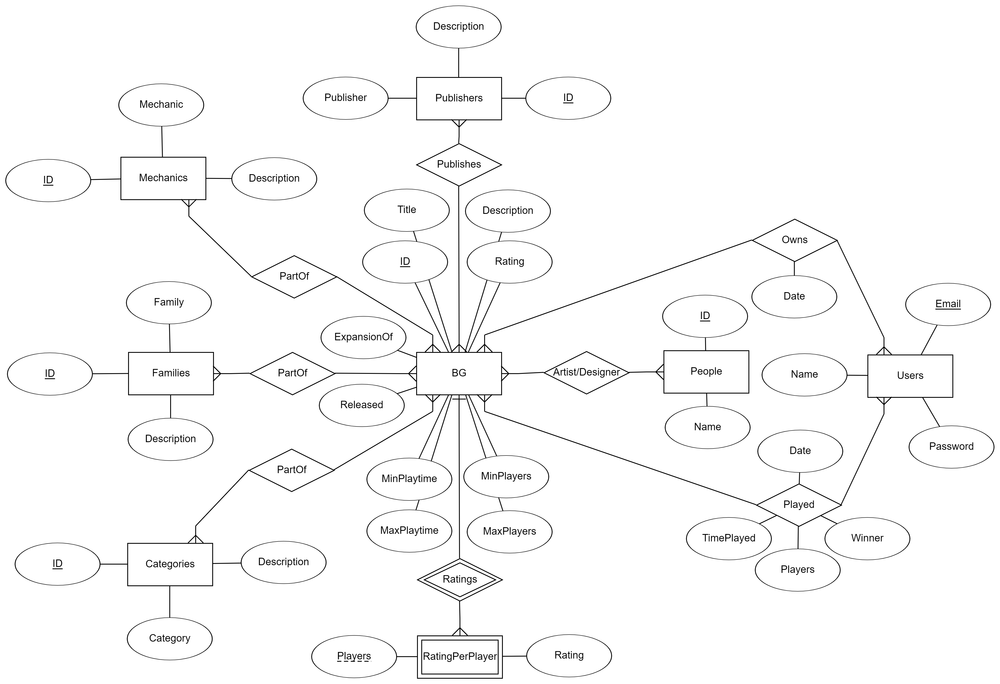

BG Database
===========

This is an application which stores information about board games 

WIP-TODO
--------

- Determine how data will be collected from BGG for the board games
- Collect the data and store it into text files for adding to the database
- Store the data in the database and test retrieval

Description
-----------

The interface to the application will be a html page which will implement the functionality
described in the use cases. The application will be built using Python flask, using psycopg2 to
interface with the postgresql database. The flask application and the postgresql database will both
be built in docker containers to allow them to be platform independent and easily portable. For now
I do not plan to implement a webserver to allow the page to be hosted, but that is a potential 
improvement that can be added if there is time. 

ER Diagram
----------

Schema 
------

::

    bg({bg_id}, title, description, released, rating, min_playtime, max_playtime, min_players, max_players, expansion_of)
        expansion_of is a foreign key referencing BG(bg_id)

    ratingsperplayer({bgid, players}, rating)
        bgid is a foreign key referencing BG(bg_id)

    users({email}, password, name)

    publishers({pub_id}, publisher, description)

    mechanics({mech_id}, mechanic, description)

    families({fam_id}, family, description)

    categories({cat_id}, category, description)

    people({p_id}, name)

    publishersrel({bg_id, pub_id})
        bg_id is a foreign key referencing BG(bg_id)
        pub_id is a foreign key referencing Publishers(pub_id)

    mechanicsrel({bg_id, mech_id})
        bg_id is a foreign key referencing BG(bg_id)
        mech_id is a foreign key referencing Mechanics(mech_id)

    familiesrel({bg_id, fam_id})
        bg_id is a foreign key referencing BG(bg_id)
        fam_id is a foreign key referencing Families(fam_id)

    categoriesrel({bg_id, cat_id})
        bg_id is a foreign key referencing BG(bg_id)
        cat_id is a foreign key referencing Categories(cat_id)

    artistrel({bg_id, p_id})
        bg_id is a foreign key referencing BG(bg_id)
        p_id is a foreign key referencing People(p_id)

    designerrel({bg_id, p_id})
        bg_id is a foreign key referencing BG(bg_id)
        p_id is a foreign key referencing People(p_id)

    owns({bg_id, email}, date)
        bg_id is a foreign key referencing bg(bg_id)
        email is a foreign key referencing users(email)

    played({bg_id, email}, date, time_played, players, winner)
        bg_id is a foreign key referencing bg(bg_id)
        email is a foreign key referencing users(email)

ER Diagram Notes
----------------
- Artist and designer relationships were combined into a single one since BG can only have 8 
  connections without having visual issues
- A user does not need to own a game to have played it
- ExpansionOf references the ID of another Boardgame
- Many of the entities only have a description field since that is the extent of information that
  is available through the BGG API, but things like publisher and people could have many more
- Every relationship except RatingsPerPlayer is a many to many
- Family refers to the concept of similar games, slightly different than category

Schema Notes
------------
- Each ID was given a distinct name so that they are distinct when joining tables
- Description also should get a similar treatment, but since those columns will not be referenced
  in any joins, it was left out for now, might get added later
- The IDs for each of the entities come from the id assigned by the BGG API
